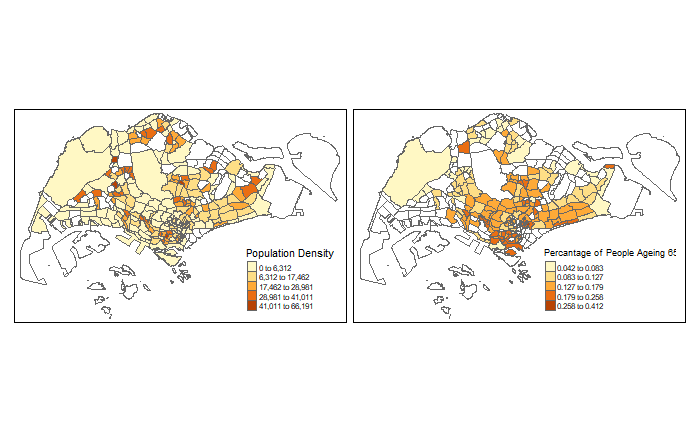
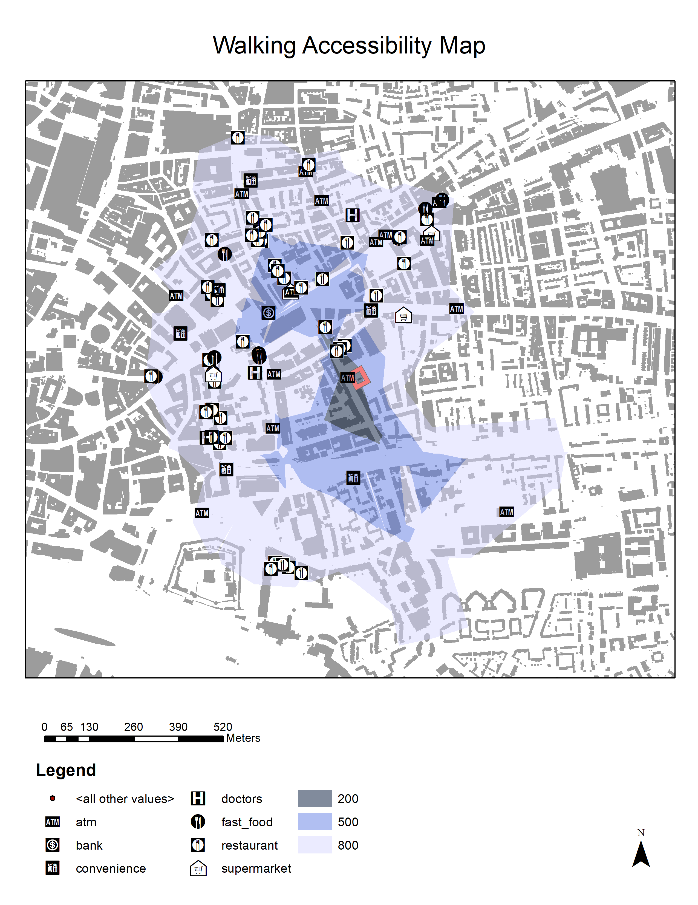

```{r setup, include=FALSE}
knitr::opts_chunk$set(echo = TRUE)
```

## R Markdown

This is an R Markdown document. Markdown is a simple formatting syntax for authoring HTML, PDF, and MS Word documents. For more details on using R Markdown see <http://rmarkdown.rstudio.com>.

When you click the **Knit** button a document will be generated that includes both content as well as the output of any embedded R code chunks within the document. You can embed an R code chunk like this:

```{r libarary, message=FALSE}
library(tidyverse)
library(maptools)
library(RColorBrewer)
library(classInt)
library(sp)
library(rgeos)
library(tmap)
library(tmaptools)
library(sf)
library(rgdal)
library(geojsonio)
```

## Including Plots

You can also embed plots, for example:

```{r load & clean data, include=FALSE}
SingaporeMap <- read_shape("subzone-census2010-shp/Subzone_Census2010.shp", as.sf = TRUE)
RawData <- read_csv("resident-population-by-subzone-age-group-and-sex.csv")
PopulationData <-  spread(RawData,level_2, value)
library(dplyr)
PopulationData <- mutate_at(PopulationData, .vars = 'level_4', .funs=toupper)
PopulationData_total <- PopulationData[which(PopulationData$level_1 == "Total"),]
PopulationData_male <- PopulationData[which(PopulationData$level_1 == "Male"),]
PopulationData_female <- PopulationData[which(PopulationData$level_1 == "Female"),]
SingaporeMap <- append_data(SingaporeMap,PopulationData_total, key.shp = "SUBZONE_N", key.data = "level_4", ignore.duplicates = TRUE)
SingaporeMap$Density <- (SingaporeMap$Total / (SingaporeMap$SHAPE_Area / (1000*1000)))
SingaporeMap$Ageing <- (SingaporeMap$`65 - 69`+ SingaporeMap$`70 - 74`+SingaporeMap$`75 - 79`+SingaporeMap$`80 - 84`+SingaporeMap$`85 & Over`) / (SingaporeMap$Total)
```

```{r plot}
tm_shape(SingaporeMap) +
  tm_polygons(c("Density", "Ageing"),
              style="jenks",
              palette="YlOrBr",
              auto.palette.mapping=FALSE,
              title=c("Population Density","Percantage of People Ageing 65+")) +
  tm_layout(legend.position = c("right", "bottom"))

```




Two maps are produces in this part, the first one contains Singapore’s population information produced by programming language R. The second map is a walking accessibility map of a student dormitory in London by using GUI based GIS program ArcMap. 

The GUI (graphic user-interface) provides a smooth operating experience for non-experienced user. Similar to other GUI based software, ArcMap transformed commands and functions into simple and skeuomorphic icons that could be easily operated. Operations that is heavily visual-depended such as selecting and moving an object or making layout of the map is easy, like the second one.   The backend process was hidden in the black box to common users and the results of any operation are also communicated visually. This result in a low learning cost: anyone with basic computer skills is able to use these GUI based software with ease. However, it also makes the reproduction very difficult as there is no clear way to trace back the production process (except for the toll that is hidden from the main operation panel). 

Due to the nature of GUI based software, it takes relatively more cost and time to develop, update and maintain. Thus, the development of such software and its ecosystem (plugins and libraries) is usually a more centralized and controlled, responsibility taken by large organizations, sometimes commercial company. The version control and release cycle decided by such developer ensure a good compatibility of older version of software and file format. The software is also relatively stable and bug-free. However, the functions are confined to what is provided, there is limited expansion capacity in this ecosystem. Hence, to use GUI based software to do GIS research, the map produced relying more on already established methods.

On the contrast, the coding-based software such as R have a steep learning curve. As programming is not a common skill adopted by common people, it became very difficult for a programming novice to master the skills to produce maps using R. It could be very difficult for one to read between the lines of code and the visualization of the operation process is not straight forward. However, it also provides great ability for reproduction and alteration once the codes can be read and written. A single line of code or loop could be used to produce multiple maps with ease, like the first map produced about Singapore’s population. It also makes the sharing and learning of production easy as well, as the piece of code could easily be send and read by different parties.

Code based software such as R is maintained by a large community, there is a large amount of third-party library immediate available for users to choose. This provides great capacity for the users to expand their ability to run analysis and produce maps by importing different libraries. Users can even code their own functions for later use. However, the convenience also comes with a cost. First is the stability of the performance, as all codes are customisable, there is potential bug that may hinder to programming from running smoothly. The compatibility is also an issue, as many of the libraries are developed by different people at different time for different version of software, potential errors may arise. Nonetheless, the coding-based software is greatly for customisation and repeated work compare to GUI based counterpart.
